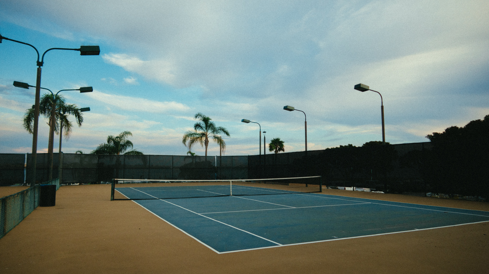

  

  

  # My Tennis Tournament

  ### [My Tennis Tournament](https://my-tennis-tournament.herokuapp.com/)

  ##### Kyeongrok Kim

  

  ## :pencil: Description

  My Tennis Tournament is a web app that tennis clubs can use to organize tournaments in their own clubs. Players who want to play in the tournament can register themselves for the upcoming tournaments. Being able to track score and the result of the matches, clubs will have successful tournaments.
  

  ## :camera_flash: Screenshots 

  |   Description | Screenshot | 
  |:-------------:| -----------|
  | <h3>Home Page</h3> |  |
  | <h3 align="center">Players List</h3> |  |
  | <h3 align="center">Tournaments List</h3> |  |
  | <h3 align="center">Tournament Details</h3> |  |
  | <h3 align="center">Edit Tournament</h3> |  |
  | <h3 align="center">Player Info</h3> |  |
  | <h3 align="center">Draw</h3> |  |

  ## :computer: Technologies Used
  
  
  
  
  
  
  
  
  
  
  
  
  

  ## :fire: Getting Started

  
 How to create a tournament 

    1. Log in with a Google account. 
    2. Click tournaments and add new tournament. 
    3. Only admins can create the tournament.

  
 How to Register for tournament 

    1. Log in with a Google account. 
    2. Register your information to the web app. 
    3. Click tournaments and choose the tournament  you want to register.
    4. In tournament details page, click register here button.

  
 How to enter scores 

    1. Log in with a Google account(admin). 
    2. Click tournaments and choose the tournament  you want to update the scores.
    3. Click the draw button. 
    4. Click score button in the draw page.

  
 How to enter scores 

    1. Log in with a Google account(admin). 
    2. Click tournaments and choose the tournament  you want to update the scores.
    3. Click the draw button. 
    4. Click score button in the draw page.

  
 Trello Board 

  <a href="https://trello.com/b/tcH4SR0K/project2"
    > https://trello.com/b/tcH4SR0K/project2 </a
  >

  
 Deployed Link (Heroku) 

  <a href="https://my-tennis-tournament.herokuapp.com/"
    > https://my-tennis-tournament.herokuapp.com/ </a
  >

## :satellite: Upcoming Features

- [:x:] Show matches in the player detail page

- [:x:] Add media query

- [:x:] Work on more CSS